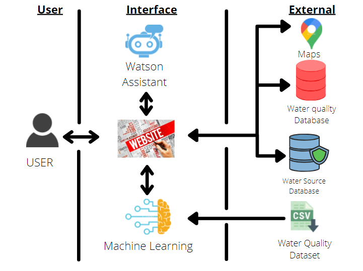
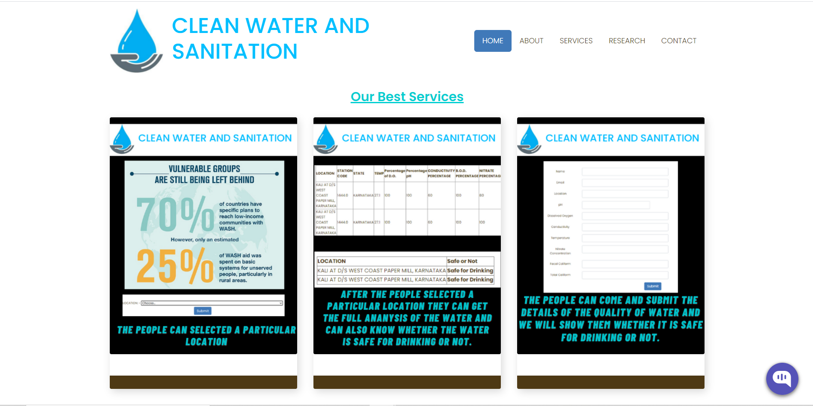
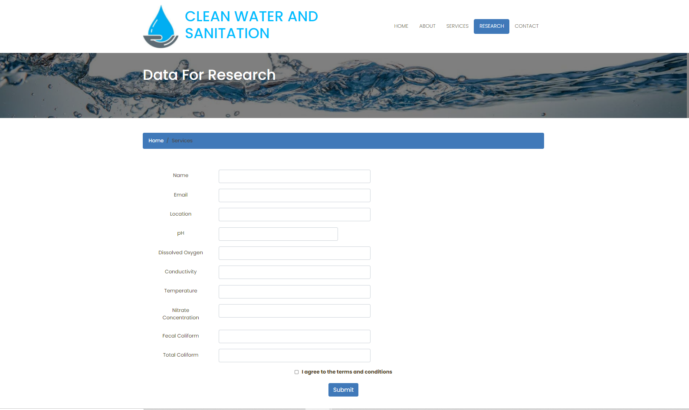
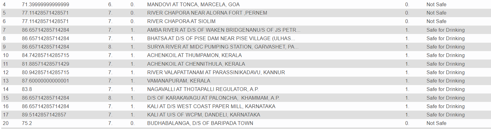

# Clean Water and Sanitation
<b><h3>What's the problem ?</h3> </b>

There is scarcity of clean water everywhere. Most people don't know whether the water present in their area that they are drinking are safe or not.   
<h3>How technology helps ?</h3>

We have predicted the quality of water using Machine learning algorithm. We have taken a dataset and have formatted the data to fit into the ML model. We have trained the model using the random forest classifier and it has given us a perfect efficiency of 100%. 

<h3>Idea</h3>

We need to create a website in which we have connected the MYQL database with the website using PHP and storing the data in the database. We need to create a machine learning model which will predict whether the water is safe for drinking or not. The data will be taken from the user and drinking quality of water will be predicted through the machine learning model.

 
<h2>Demo Video</h2>

<h3>The Highlights of Our Project</h3>

The roadmap of our project is   

  
The first page of our website tell us the services provided. 
  
We have predicted whether the water is safe or not by training a machine learning model(Random Forest Classifier) and the data from the database provided by the user in form 1 will also be predicted. 
&nbsp;&nbsp;
  
THe database which contains all the data is given below:-  

 
Please import the db files in MYSQL and then use the folder.
